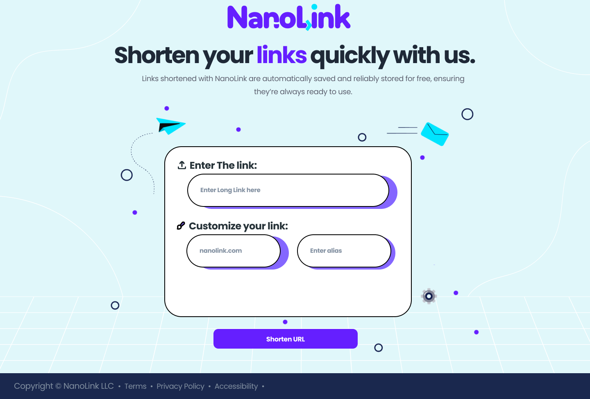
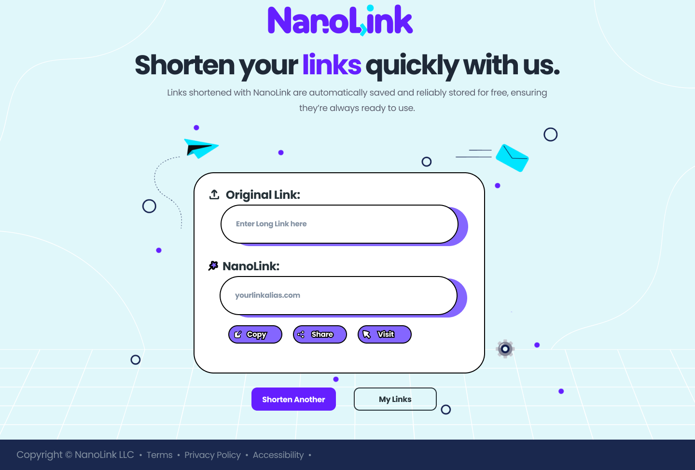
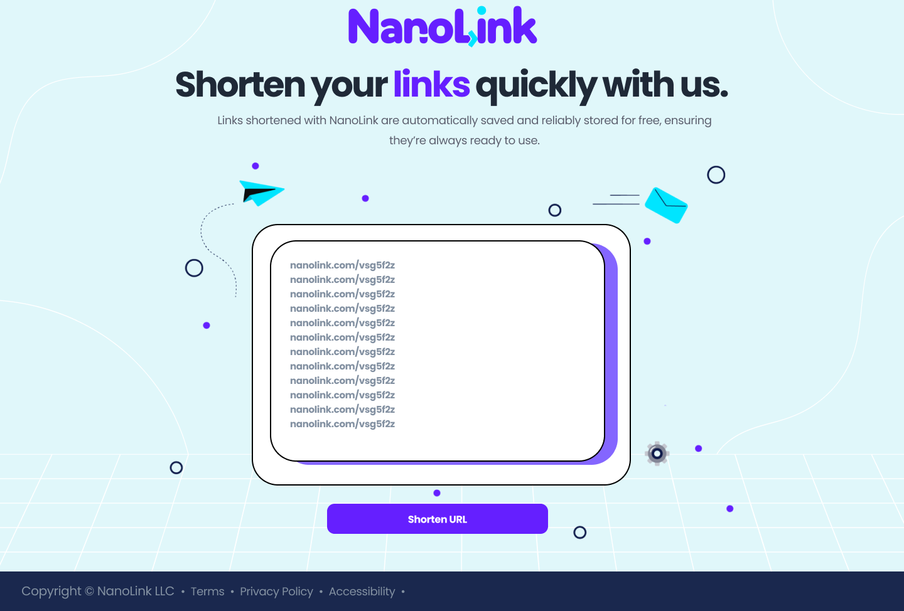

# Nanolink: A Flutter App for Link Shortening

**Nanolink** is a sleek and efficient web application built using Flutter to provide seamless link-shortening services. The website offers a user-friendly interface for generating and managing shortened URLs, along with analytics and other essential features.

## Features

* **Link Shortening:** Create, manage, and delete shortened URLs with ease.
* **Analytics Tracking:** View link performance, including click rates, user locations, and device types.
* **Custom URL Slugs:** Create custom slugs for your shortened URLs.
* **Expiration Management:** Set expiration dates for links and manage expired URLs.

## Technologies

* **Flutter:** Google's UI toolkit for building natively compiled applications for mobile, web, and desktop from a single codebase.
* **Dart:** Programming language optimized for building cross-platform apps with Flutter.

## Screenshots






## Getting Started

### Prerequisites
* Flutter SDK (version 3.0 or higher)
* Dart SDK (version 2.0 or higher)
* A code editor like VSCode or Android Studio

### Installation


1. Clone the repository:
   ```bash
   git clone [the repo url]
2. Create a virtual environment:
   ```bash
   python -m venv venv
   source venv/bin/activate  # or venv\Scripts\activate on Windows
3. Install dependencies:
   ```bash
   pip install -r requirements.txt
4. Configure database settings (update settings.py with your database credentials).
5. Run migrations:
   ```bash
   python manage.py migrate
6. Start the development server:
   ```bash
   python manage.py runserver

### Contributing
We welcome contributions to NanoLink! Please refer to our contribution guidelines for details.

### License
This project is licensed under the raufzer license.
